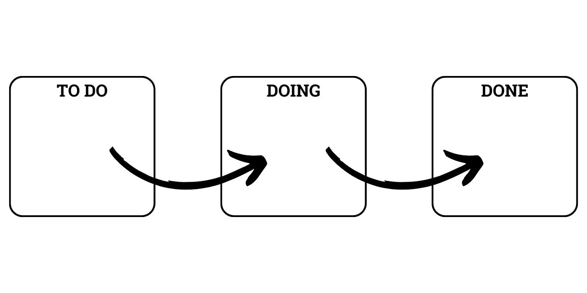
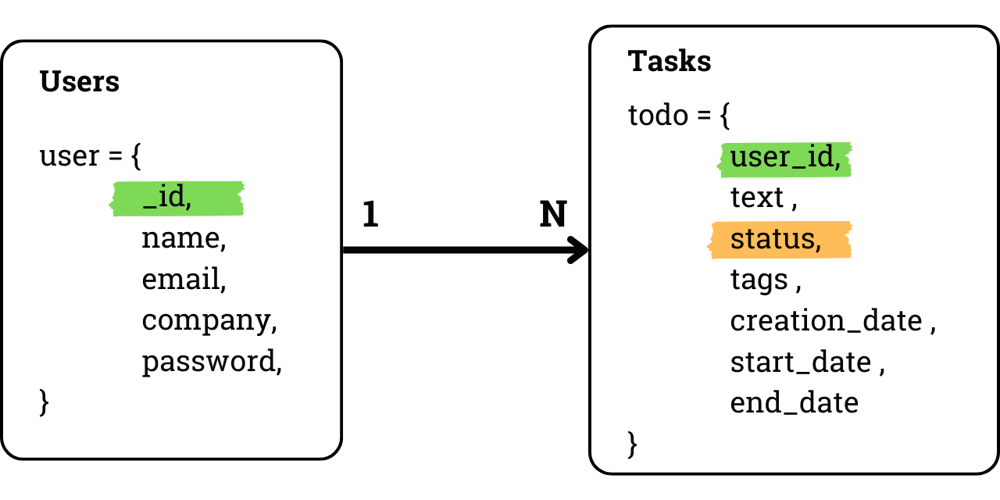
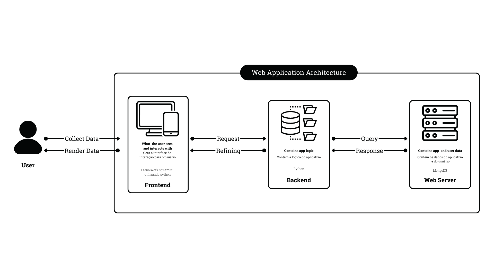

The main goal of this project was to learn how to create and manage a mongodb database and its collections, while also practicing creating secure authentication login process.

I chose streamlit as a framework because of its versatility and easy to create interface components/widgets.

## How I divided this project

1. Kanban dashboard
    - using python and streamlit
    - using mongodb to store all the data from the tasks

2. Users login and signup interface
    - using mongodb to store all data from client 
    - clients can only see their tasks

### What is kanban?
Is an organization method of visualizing all your tasks based on the state of completion they have. In this case, I created a status for each task and gave them a flow of completion from “to do” to “doing” and when the task is finalized, “done”.

### What are the databases I created?
One user can create multiple tasks, and the dashboard will only present the task of the logged user.

## Repos Organization
**app**: main folder that contains the application

**assets**: figures and logos

**pages**: streamlit requires this folder that contains extra subpage in order to create a multipage application.
- **About_this_project.py**: contains a detailed explanation about this project and how I built it

**utils**: contains this project’s utilities, in order to keep a clean code and organize functions for more than once usability
- **auth.py**: authentication, login and signup functions
- **createCards.py**: functions to style the kanban columns and cards
- **getDatabase.py**: class to centralize functions that access the todo’s database
- **getUserInfo.py**: class to centralize functions that access the users database

**To_do_list.py**: project’s main page

## Architecture
